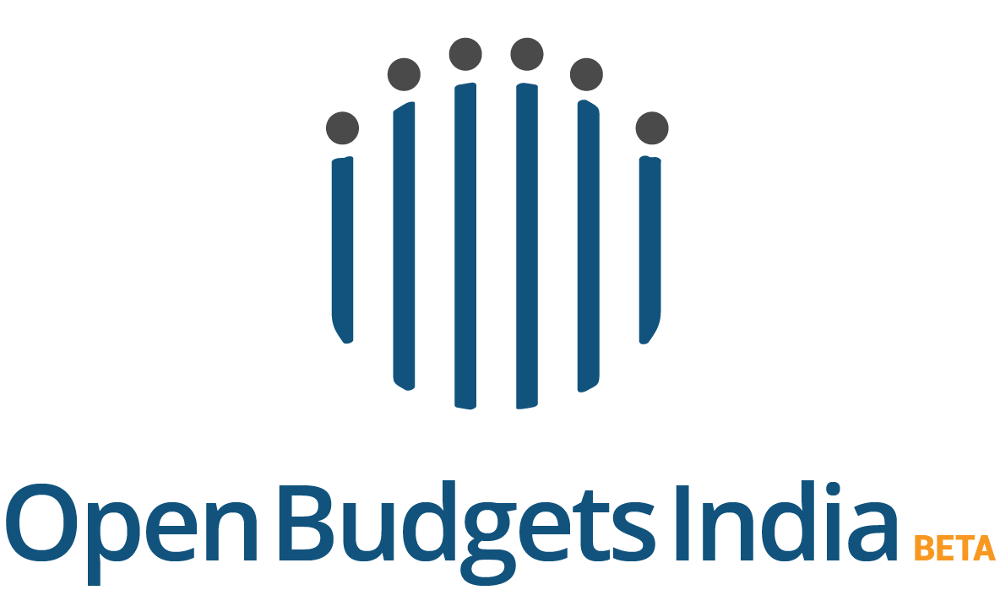

# ckanext-openbudgetsin_theme
## Extension to provide custom theme to OpenBudgetsIndia(CKAN)
The extension provides multiple plugins to provide basic theme, new hierarchical arrangement of organizations, canonical view of visualizations for the dataset resource view.
* Openbudgetsin_ThemePlugin - Provides basic theme and structure to the ckan instance.

* HierarchyDisplay - The  plugin provides capability of add new hierarchial arrangement of organizations.The plugin is   

* FeaturedviewsPlugin - Display CKAN resource views on dataset pages. This is mainly used to render suitable visualizations in the same view of the datasets. 

## Compatibility

This extension requires CKAN v2.2 or later. 

## Installation

    $ git clone https://github.com/cbgaindia/ckanext-openbudgetsin_theme.git
    $ cd ckanext-openbudgetsin_theme
    $ python setup.py develop
    
    
Add to the list of plugins: 

    ckan.plugins = ... featuredviews hierarchy_display hierarchy_form openbudgetsin_theme

## Credits
HierarchyDisplay plugin has been forked from - [ckanext-hierarchy](https://github.com/datagovuk/ckanext-hierarchy). 
FeaturedviewsPlugin has been forked from - [ckanext-featuredviews](https://github.com/datacats/ckanext-featuredviews).
